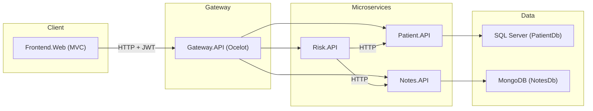

# P10 – MediLabo Solutions

Patient management application for a health insurance organization that identifies patients at risk of developing type 2 diabetes using demographic information and medical notes recorded by healthcare professionals.

The project is built using a **microservices architecture** with **.NET 8**, orchestrated behind an **API Gateway** using **Ocelot**, and secured with **JWT authentication**.

---

## Architecture



The application is composed of several independent services:

| Service | Role | Port (local) |
|---|---|---|
| `Frontend.Web` | MVC web application for medical staff (viewing/editing patient records, notes, and diabetes risk assessments) | 5002 |
| `Gateway.API` | Single entry point for backend communication, routing requests through Ocelot | 5000 |
| `Patient.API` | Manages patient information and identity-related data | 5001 |
| `Notes.API` | Manages medical notes linked to patients, stored in MongoDB | 5003 |
| `Risk.API` | Calculates patient diabetes risk levels using data retrieved from Patient and Notes services | 5004 |

---

# Tech Stack

- **.NET 8** (ASP.NET Core Web API + MVC)
- **Entity Framework Core** with **SQL Server** (`Patient.API`)
- **MongoDB** (`Notes.API`)
- **Ocelot** for API Gateway / reverse proxy
- **JWT Bearer authentication** shared across services
- **Swagger / OpenAPI** for API documentation
- **Docker & Docker Compose** for containerization and local orchestration

---

# Prerequisites

Before running the project, install:

- [.NET 8 SDK](https://dotnet.microsoft.com/download/dotnet/8.0)
- [Docker Desktop](https://www.docker.com/products/docker-desktop/)
- Visual Studio 2022 (17.8+) or another .NET 8 compatible IDE

---

# Configuration

The project uses environment variables for sensitive information such as:

- SQL Server password
- JWT signing key

Create a `.env` file at the repository root (do not commit this file):

```env
SA_PASSWORD=YourSqlPassword!
JWT_KEY=YourSufficientlyLongSecretJwtKey
```

---

# Getting Started with Docker Compose

From the project root, run:

```bash
docker compose up --build
```

This starts all application services:

| Service | Description | Port |
|---|---|---|
| `sqlserver` | SQL Server 2022 database | 1433 |
| `mongodb` | MongoDB database | 27017 |
| `patient.api` | Patient microservice | 5001 |
| `notes.api` | Notes microservice | 5003 |
| `risk.api` | Risk assessment microservice | 5004 |
| `gateway.api` | API Gateway | 5000 |
| `frontend.web` | MVC frontend application | 5002 |

Once started, the application is available at:

<http://localhost:5002>

Swagger documentation is available for APIs in development mode, for example:

<http://localhost:5003/swagger>

---

# Running Locally (Without Docker)

Each service can also be started independently using Visual Studio or the .NET CLI:

```bash
dotnet run --project Patient.API
dotnet run --project Notes.API
dotnet run --project Risk.API
dotnet run --project Gateway.API
dotnet run --project Frontend.Web
```
Alternatively use Visual Studio to create a new start profile to launch all projects on debug. 

When running locally, update the configuration files:

- database connection strings
- service URLs
- authentication settings

inside each project's `appsettings.json`.

---

# Security

All backend microservices:

- `Patient.API`
- `Notes.API`
- `Risk.API`

validate **JWT Bearer tokens** issued using shared authentication settings:

- `Issuer`
- `Audience`
- signing key

These values are configured through environment variables defined in `docker-compose.yml`.

The API Gateway acts as the main entry point and forwards authenticated requests to the appropriate microservice.

---

# Green Code

A Green Code analysis has been performed for this project, covering:

- resource consumption
- Docker optimization opportunities
- API communication efficiency
- database access improvements
- infrastructure sizing recommendations

Additional documentation:

- [`GREENCODE.md`](./GREENCODE.md)

---

# Repository Structure

```text
P10_MediLaboSolutions/
├── Frontend.Web/              # Web application for medical staff (MVC)
├── Gateway.API/               # API Gateway (Ocelot)
├── Patient.API/               # Patient management microservice
├── Notes.API/                 # Medical notes microservice
├── Risk.API/                  # Diabetes risk assessment microservice
├── P10_MediLaboSolutions.sln  # Visual Studio solution
├── docker-compose.yml         # Docker Compose configuration
├── README.md                  # Project documentation
└── GREENCODE.md               # Green Code analysis and recommendations
```

---

# Project Purpose

MediLabo Solutions demonstrates a modern healthcare-oriented backend architecture using:

- independent microservices
- containerized deployment
- secure API communication
- separate data storage strategies
- automated risk evaluation logic

This project is intended as an educational implementation demonstrating .NET microservices concepts, API security, database integration, and cloud-ready deployment practices.
